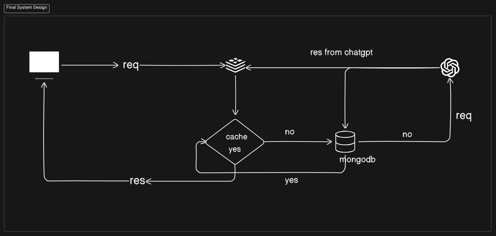
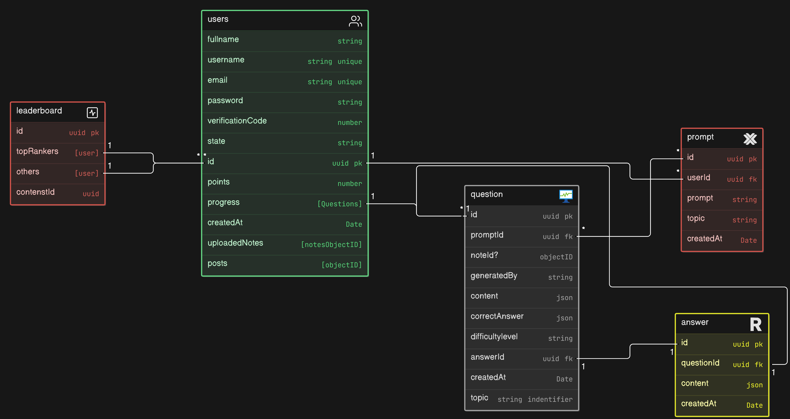

### Description:

This is self learning platform. It is provide you a guidence that can helps you to creak your MCA exam. In this platform you can talk with other state or your state current year [students.](http://students.It) It’s have two version one is paid and another is free version.

### Key features:

- A log in and registration page for student.
- Student profile Dashboard where user can see their rank and preparation roadmap, How many times they solve some question and weekly quiz and see their contributes like some articles and Question generation.
- Automatically fetch their exam shedule by state wise, when user select a state.
- Only one user can selected at most one state.
- Upload their their document or own startegy, AI can makes roadmap.
- They can share pdf with some prompt for manageable questions.
- After attempt a quiz or session AI can summarize it.
- AI Feed Back page.
- Create for west bengal first.

### Tech Stack:

**Frontend management:** 

Next JS, Tailwind, Auth JS, type Script and axios.

**Backend Management:**

Express JS, mongoose, bcrypt Hashing, Zod, 

### System Design:

### Schema Design:
